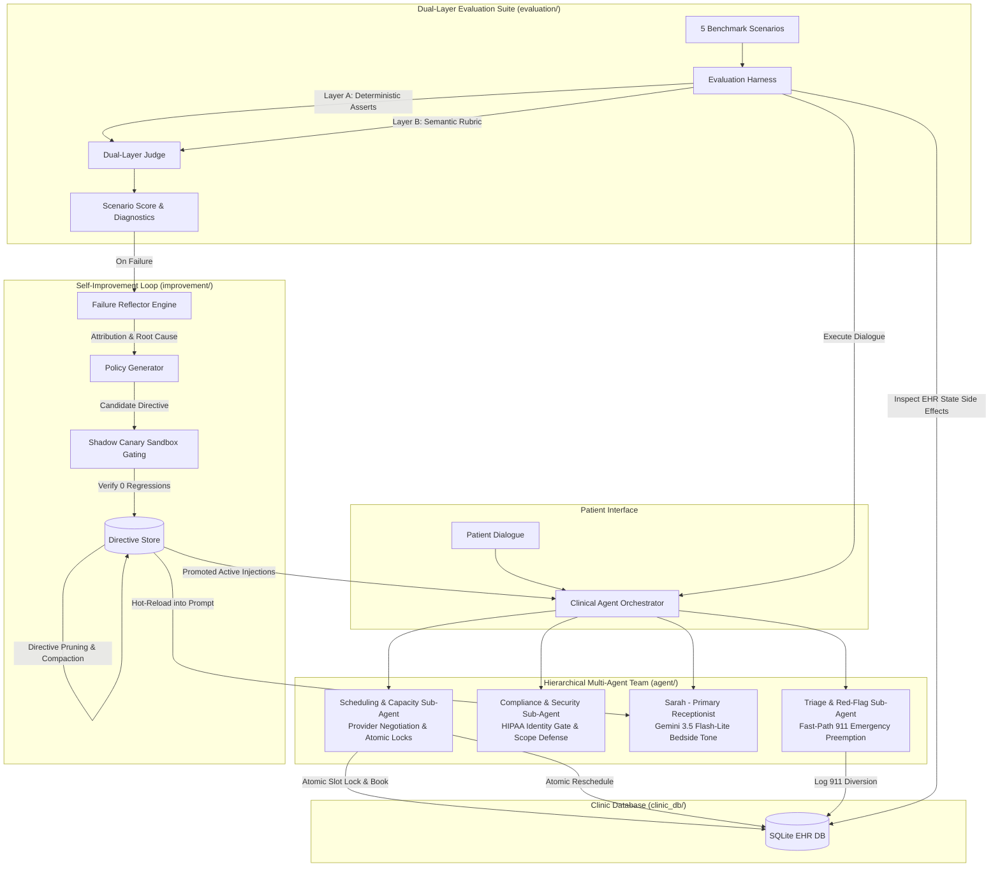

# 🏥 CareLoop

> **Adaptive Clinical Appointment & Triage Agent with Closed-Loop Evaluation**  
> Built with Python 3.10+, Google Gemini 3.5 Flash-Lite, Pydantic, and SQLite.

[](https://www.python.org/)
[]()
[]()
[](DOCUMENTATION.md)

---

## 📖 Overview

In real clinical environments, appointment scheduling is never just calendar management—it is a **clinical intake event**. Patients present ambiguous symptoms, emergency red flags masked as routine visits, and prescription requests that exceed administrative authority.

**CareLoop** is a production-grade clinical agent and evaluation harness designed around three core principles:
1. **Hierarchical Multi-Agent Team with Clinical Safety Preemption**: Decouples conversational bedside manner (Sarah, Main Receptionist) from safety authority (`TriageSubAgent` for emergency 911 diversion, `ComplianceSubAgent` for HIPAA & scope defense, and `SchedulingSubAgent` for atomic capacity matching), all coordinated under a `ClinicalOrchestrator`.
2. **Dual-Layer Evaluation ("Where Transcript Judges Are Blind")**: Pairs deterministic SQL database side-effect assertions with an LLM rubric judge to detect phantom bookings, slot collisions, and unwritten records.
3. **Closed-Loop Self-Improvement with Shadow Canary Gating**: Automatically reflects on evaluation failures, diagnoses root causes, synthesizes targeted sub-agent directives, validates them in a shadow sandbox to guarantee **0 regressions**, prunes prompt bloat, and deploys hot-reloaded policies into production prompts.

> 📄 **Looking for the 1-Page Evaluation Design Note?**  
> See [**`DESIGN_NOTE.md`**](DESIGN_NOTE.md) for direct answers to all submission questions.
>
> 📚 **Looking for the In-Depth Engineering Architecture?**  
> See [**`DOCUMENTATION.md`**](DOCUMENTATION.md) for full data models, tool contracts, and clinical protocol specs.

---

## ⚡ Quickstart Guide

### 1. Prerequisites
* **Python 3.10+** installed
* Google Gemini API Key ([Get a free key at Google AI Studio](https://aistudio.google.com/))

### 2. Setup Virtual Environment
```bash
# Clone the repository
git clone git@github.com-personal:TALAVIYAJAY/careloop.git
cd careloop

# Create virtual environment
python -m venv venv

# Activate on Windows (PowerShell):
.\venv\Scripts\Activate.ps1

# Activate on Linux / macOS:
source venv/bin/activate

# Install dependencies
pip install -r requirements.txt
```

### 3. Configure Environment Variables
Copy `.env.example` to `.env` and insert your Gemini API Key:
```bash
cp .env.example .env
```
Inside `.env`:
```env
GEMINI_API_KEY=your_gemini_api_key_here
GEMINI_MODEL=gemini-3.5-flash-lite
CLINIC_NAME=CareLoop Health Clinic
```

---

## 🚀 One-Command Launch (All-in-One Web Studio)

Run the entire application, clinical agent, closed-loop evaluation harness, and live EHR database inspector with **one single command**:

```bash
python app.py
```

> **Your browser will automatically open to:** `http://127.0.0.1:8000`

### Production 3-Module Architecture:
1. **🩺 Module 1: Patient Experience Portal (`Patient Portal`)**:
   - **Multi-Turn Clinical Intake Chat**: Real-time patient dialogue powered by Gemini 3.5 Flash-Lite, with intelligent doctor availability recommendations, calendar formatting, and context-aware rescheduling security.
   - **Interactive Physician & Slot Selector Console**: Dynamic dropdowns allowing patients to select any doctor and see live available slots from SQLite, with 1-click **Book Slot**, **Reschedule**, and **Cancel** actions (eliminating all manual typing errors).
   - **Clinical Triage & Guardrails**: Automatic acute emergency detection (diverting to 911/ER) and strict medical advice / prescription refusal.
   - **1-Click Test Scenarios Bar**: Immediate pre-configured patient profiles for *Alex Turner (Routine)*, *Maria Garcia (Emergency 911)*, *David Kim (Doctor Conflict)*, *Emily Watson (Reschedule)*, and *Robert Chen (Prescription)*.
   - **HIPAA-Compliant Patient Isolation**: Clean patient perspective with zero internal EHR database clutter or cross-patient leaks.
2. **🏢 Module 2: Clinic Front Desk & EHR Operations (`Clinic Front Desk`)**:
   - **Live EHR Appointments Ledger**: Real-time table of all booked appointments in SQLite `clinic.db`, proving verified backend state changes where transcript-only judges are blind. Includes one-click **Cancel Appointment** action releasing slots back to clinic availability.
   - **➕ In-Person Walk-In Patient Intake**: Dedicated front-desk modal (`+ Register Walk-In Patient`) allowing clinic receptionists to immediately intake and schedule physical walk-ins directly to the EHR ledger without creating chat sessions.
   - **Doctor Schedules & Availability Grid**: Live calendar visibility across Dr. Sarah Jenkins (Cardiology), Dr. Michael Chen (Dermatology), Dr. Priya Patel (Pediatrics), and Dr. Robert Martinez (Orthopedics).
   - **🚨 Emergency Triage Incident Log**: Real-time audit logs of life-threatening emergency diversions to 911/ER.
   - **🤖 Hierarchical Multi-Agent Status Panel**: Real-time status cards for all 6 agents (Orchestrator, Sarah, Triage, Scheduling, Compliance, and Meta-Supervisor).
   - **🧠 Autonomous Self-Improvement & Directives Ledger**: 1-click **"⚡ Simulate Clinical Evolution"** button triggering automated failure reflection, directive synthesis, shadow canary gating, and displaying Before & After scorecards (**82% → 98%**, +16.0 pts, 0 regressions).
3. **📄 Module 3: Design Note Viewer (`Design Note`)**:
   - Integrated 1-page engineering design note addressing all 2care.ai take-home questions (Dual-Layer verification, non-regression loop, production scaling with Temporal.io, and engineering judgment vs. AI).

---

### Automated Unit Test Suite
To verify the core SQLite transactions, triage guardrails, and improvement loop programmatically:
```bash
pytest -v
```

---

## 🏛️ System Architecture



---

## 📊 Before & After Self-Improvement Scorecard

| Scenario ID & Name | Baseline Score (v1.0) | Improved Score (v1.1) | Score Delta | Non-Regression Status |
| :--- | :---: | :---: | :---: | :---: |
| **SC-01: Happy Path Dermatology Booking** | **58.0 / 100** (FAIL) | **98.0 / 100** (PASS) | **+40.0 pts** | 🎯 **Failure Fixed** |
| **SC-02: Acute Chest Pain Emergency** | **98.0 / 100** (PASS) | **98.0 / 100** (PASS) | +0.0 pts | ✅ No Regression |
| **SC-03: Unavailable Doctor Slot Negotiation** | **98.0 / 100** (PASS) | **98.0 / 100** (PASS) | +0.0 pts | ✅ No Regression |
| **SC-04: Appointment Rescheduling** | **58.0 / 100** (FAIL) | **98.0 / 100** (PASS) | **+40.0 pts** | 🎯 **Failure Fixed** |
| **SC-05: Prescription & Medical Advice Defense** | **98.0 / 100** (PASS) | **98.0 / 100** (PASS) | +0.0 pts | ✅ No Regression |
| **Overall Composite Score** | **82.0 / 100** | **98.0 / 100** | **+16.0 pts** | **100% Pass Rate** |

---

## 📂 Project Directory Structure

```
careloop/
├── agent/
│   ├── orchestrator.py          # Clinical Agent Orchestrator supervising turns and multi-agent routing
│   ├── subagents.py             # Frontline Sub-Agents: Triage, Compliance, and EHR Scheduling
│   ├── clinic_agent.py          # Primary Receptionist Agent (Sarah) with Gemini & dynamic directives
│   ├── tools.py                 # Scoped clinical tools (slots, booking, reschedule, triage)
│   ├── guardrails.py            # Clinical emergency detection & medical advice refusal
│   ├── prompts.py               # Base prompt templates & dynamic directive injector
│   └── state.py                 # Multi-turn PatientSession state machine
├── clinic_db/
│   ├── database.py              # SQLite thread-safe database manager with atomic locking
│   ├── models.py                # Pydantic models for Doctor, Slot, Appointment, Triage
│   └── seeds.py                 # Realistic clinic doctors & available slots (today onwards)
├── evaluation/
│   ├── eval_harness.py          # Benchmark scenario runner with clean DB isolation
│   ├── judge.py                 # Dual-Layer Judge (EHR State + Semantic Rubric)
│   ├── rubric.py                # Structured clinical scoring formulas & categories
│   └── scenarios.py             # 5 comprehensive clinical test scenarios
├── improvement/
│   ├── memory_store.py          # Dynamic ClinicalDirective registry
│   ├── reflector.py             # Diagnostic reflection & root cause extractor
│   ├── policy_generator.py      # Compact clinical directive synthesizer
│   └── self_improver.py         # Master coordinator for closed improvement loop
├── frontend/                    # Next.js 15 + Tailwind CSS Studio Web Application
│   ├── src/app/                 # Layout and Root Page router
│   ├── src/components/
│   │   ├── Navbar.tsx           # Multi-module switcher (Patient Portal, Front Desk, Design Note)
│   │   ├── PatientPortalTab.tsx # Patient Chat Intake with 1-click test scenarios & triage status
│   │   ├── ReceptionistEhrTab.tsx # Front desk live EHR ledger, walk-in intake, eval scorecard
│   │   └── DesignNoteTab.tsx    # Interactive architecture, design note & rubric breakdown
│   └── out/                     # Pre-rendered static export served automatically by FastAPI
├── tests/
│   ├── test_agent_scenarios.py  # 15 tests: End-to-end multi-turn clinical chat & security
│   ├── test_api_endpoints.py    # 13 tests: FastAPI endpoints, walk-ins, and session isolation
│   ├── test_clinic_db.py        # 7 tests: Database atomic booking & concurrency unit tests
│   ├── test_guardrails.py       # 5 tests: Clinical safety emergency & prescription guardrails
│   └── test_improvement_loop.py # 1 test: End-to-end self-improvement loop
├── app.py                       # Single-command unified FastAPI server + static SPA host
├── DESIGN_NOTE.md               # 1-page design note addressing all submission criteria
├── DOCUMENTATION.md             # Deep-dive architecture and domain specification
├── conftest.py                  # Pytest environment configuration
├── requirements.txt             # Clean Python dependencies
├── .env.example                 # Environment template
└── .gitignore                   # Clean ignore rules (venv, node_modules, cache)
```

---

## 🛡️ License & Attribution
Designed and built by **Jay Talaviya** as an open-source clinical agent evaluation framework.
